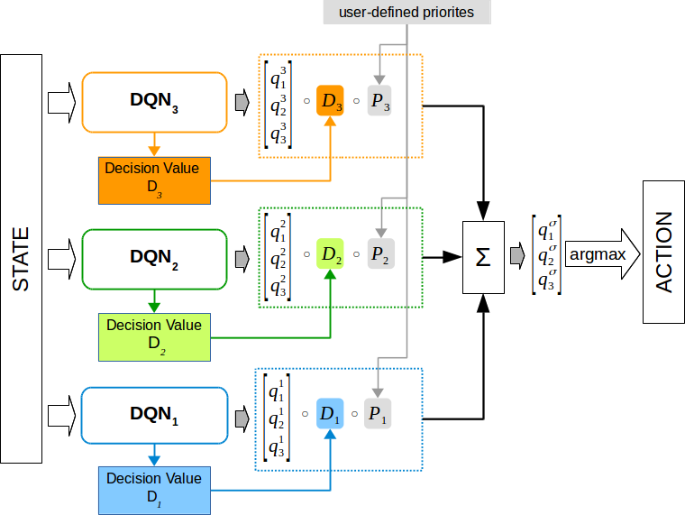
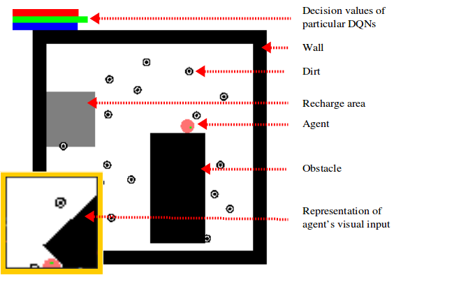

# Modular Multi-Objective Reinforcement Learning with Decision Values

This repository contains source codes for work described in:
*"Modular Multi-Objective Deep Reinforcement Learning with Decision Values"*, Tomasz Tajmajer
https://arxiv.org/abs/1704.06676



### Cleaner environment

Cleaner is a simple game which simulates an autonomous vacuum cleaner. It is based on OpenAI's gym framework.
Cleaner comes in several versions: multi-objective and single-objective and it can be used with existing RL methods.

To run cleaner run `cleaner_random_agent.py` script.

To test cleaner with standard DQN run `cleaner_test_with_standard_dqn.py`

While cleaner is running you can use 'm' key to display full map and 'q' key to hide it.



### Preparation
```
python3 -m venv env
source env/bin/activate
pip install -r requiremets.txt
```


### Running multi-objective DQNs with decision values

`dqn_decision_values.py` script will run cleaner with a 3-objective DQN.
After training the model will be saved.

### Testing

After training the model may be tested with different priorities assigned to each of the objectives:

`python dqn_decision_values_load.py MODEL_FILE_NAME PRIORITY1 PRIORITY2 PRIORITY3 NUM_OF_EPISODES `

e.g.

`python dqn_decision_values_load.py example_model 0.1 0.2 0.7 10`


### Help

For more information refer to the paper or contact me